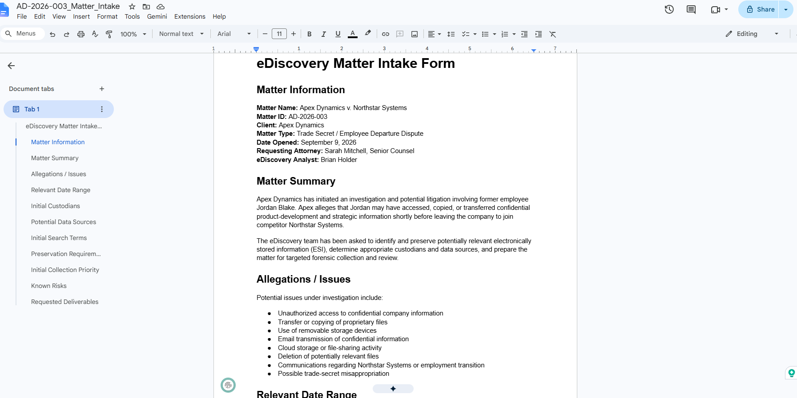
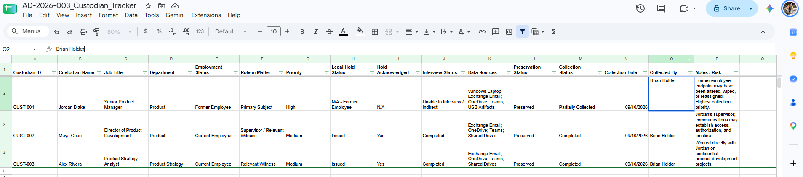
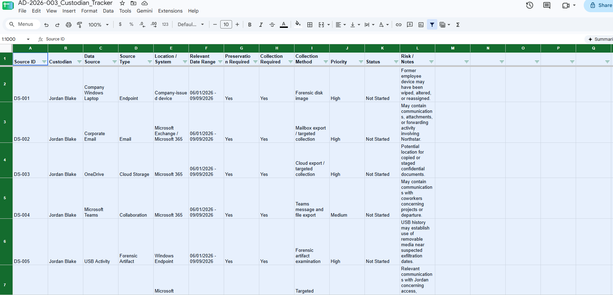
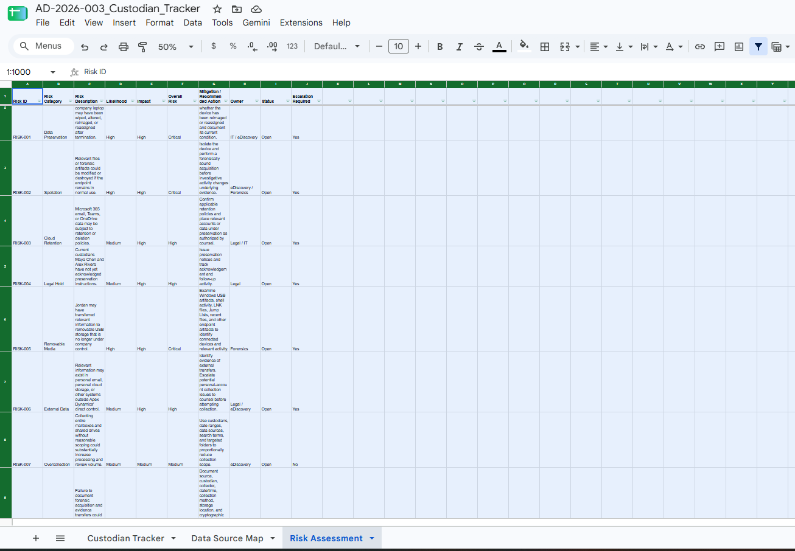
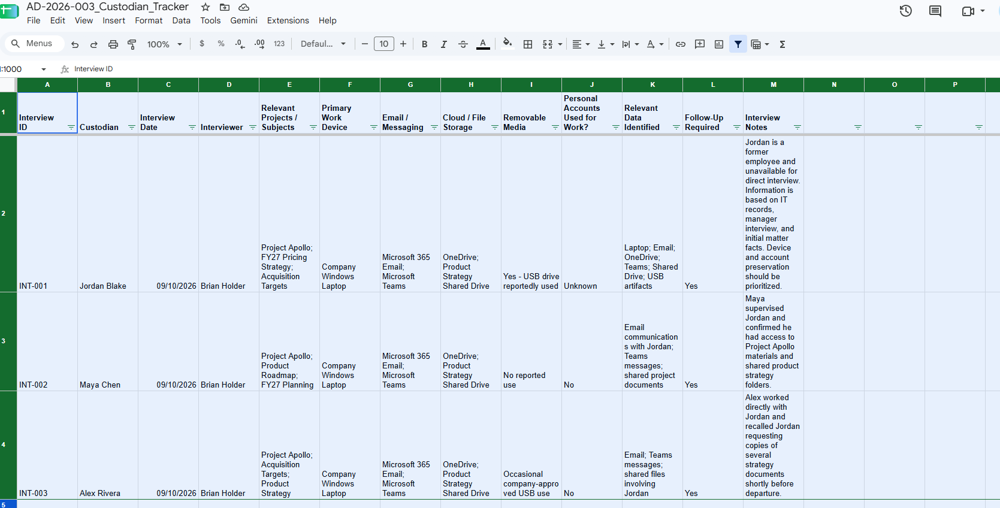
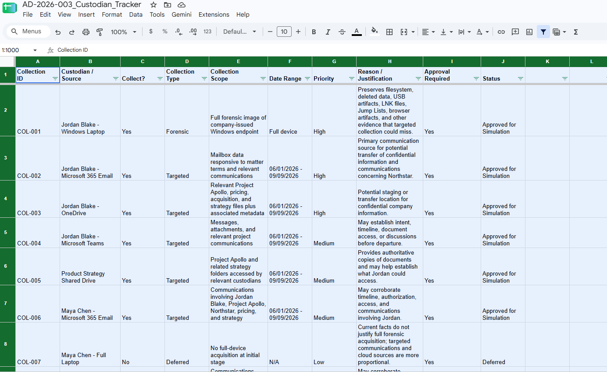
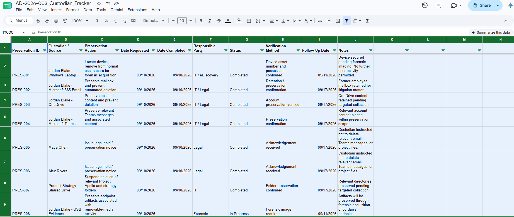
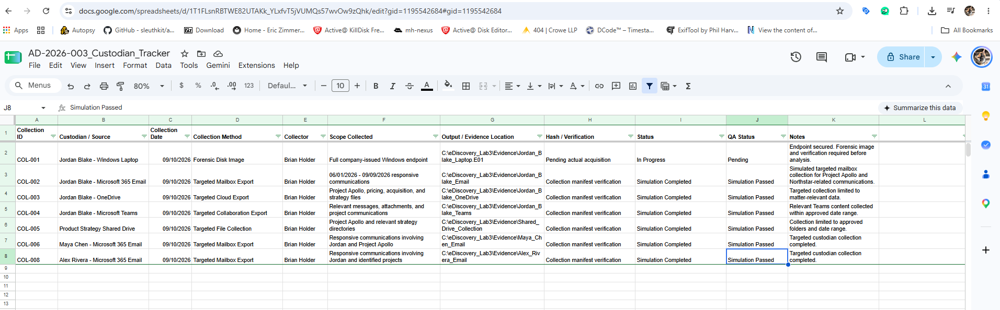
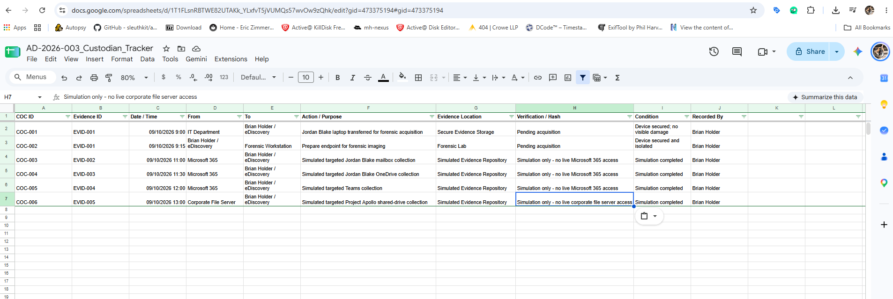

# eDiscovery Matter Intake, Preservation & Collection Planning Lab

## Overview

This project is a simulated eDiscovery matter designed to demonstrate the early stages of the Electronic Discovery Reference Model (EDRM), including identification, preservation, collection planning, custodian management, risk assessment, and chain-of-custody documentation.

The fictional matter involves Apex Dynamics and a former employee suspected of transferring confidential product-development information before joining a competitor.

**Matter:** Apex Dynamics v. Northstar Systems  
**Matter ID:** AD-2026-003  
**Matter Type:** Trade Secret / Employee Departure Investigation

> **Training Disclaimer:** This project is a simulation. No real client, employee, Microsoft 365 tenant, corporate system, or confidential data was accessed. Microsoft 365 and corporate-system collection activities shown in this lab are simulated.

---

## Objectives

This lab demonstrates the ability to:

- Perform initial eDiscovery matter intake
- Identify relevant custodians and ESI sources
- Map custodians to potential data repositories
- Assess preservation and spoliation risks
- Track legal hold and preservation activity
- Conduct simulated custodian interviews
- Develop a proportional collection strategy
- Document collection status and QA
- Maintain chain-of-custody records
- Distinguish targeted eDiscovery collection from forensic acquisition

---

## Scenario

Apex Dynamics identified potential evidence that former Senior Product Manager **Jordan Blake** accessed or transferred confidential company information before leaving for competitor **Northstar Systems**.

Potentially relevant information included:

- Project Apollo materials
- FY27 pricing strategy
- Acquisition information
- Product strategy documents
- Email communications
- OneDrive content
- Microsoft Teams messages
- Shared-drive data
- USB/removable-media activity

Initial custodians included:

- **Jordan Blake** — Primary subject
- **Maya Chen** — Director of Product Development / Jordan's supervisor
- **Alex Rivera** — Product Strategy Analyst

---

## Matter Intake

The initial matter intake documented the allegations, relevant date range, custodians, potential data sources, search concepts, preservation requirements, collection priorities, and known risks.

---

## Custodian Tracking

A custodian tracker was developed to manage:

- Employment status
- Matter role
- Priority
- Legal hold status
- Hold acknowledgement
- Interview status
- Data sources
- Preservation status
- Collection status
- Collection date
- Collector

---

## Data Source Mapping

Potential ESI sources were mapped to individual custodians and systems.

Sources included:

- Windows endpoints
- Microsoft 365 email
- OneDrive
- Microsoft Teams
- Corporate shared drives
- USB/removable-media artifacts

Different collection methods were selected based on the characteristics of each data source.

---

## Risk Assessment

The matter was assessed for potential preservation and collection risks, including:

- Endpoint alteration or reassignment
- Spoliation
- Cloud retention
- Legal hold acknowledgement
- Removable-media activity
- External or personal accounts
- Overcollection
- Chain-of-custody failures
- Incomplete source identification
- Scope creep

Mitigation actions, owners, and escalation requirements were documented.

---

## Custodian Interviews

Simulated custodian interviews were used to identify additional systems, projects, communications, and potential sources of responsive information.

---

## Collection Scope

Collection decisions were based on relevance, proportionality, preservation risk, and the characteristics of each source.

The former employee's endpoint was designated for forensic acquisition because endpoint artifacts could contain evidence unavailable through a standard document collection.

Other custodians were scoped primarily for targeted email, collaboration, and cloud collection.

Personal accounts were escalated to counsel rather than collected without authorization.

---

## Preservation

Simulated preservation activity included:

- Endpoint isolation
- Mailbox preservation
- OneDrive preservation
- Teams preservation
- Legal hold acknowledgement
- Shared-drive preservation
- Protection of USB-related forensic artifacts

---

## Collection Tracking

The collection log documents:

- Collection source
- Collection method
- Scope
- Collector
- Evidence location
- Verification method
- Collection status
- QA status

Microsoft 365 and corporate-system collections in this project are clearly marked as simulations.

The endpoint forensic acquisition remained pending so that no fictitious forensic image or cryptographic hash was represented as actual evidence.

---

## Chain of Custody

A chain-of-custody log was created to document:

- Evidence ID
- Date and time
- Evidence transfer
- Handler
- Purpose
- Evidence location
- Verification status
- Evidence condition

No fabricated cryptographic hashes were used.

---

## Skills Demonstrated

- eDiscovery matter intake
- EDRM workflow
- Custodian identification
- ESI data-source mapping
- Legal hold tracking
- Preservation planning
- Collection scoping
- Proportionality analysis
- Risk assessment
- Spoliation-risk identification
- Custodian interviews
- Collection tracking
- Chain of custody
- Endpoint forensic acquisition planning
- Microsoft 365 collection concepts
- Documentation and defensibility

---

## Tools Used

- Google Sheets
- Google Docs
- Windows
- GitHub
- eDiscovery workflow documentation

---

## Repository Files

The repository includes:

- Matter intake documentation
- Full eDiscovery matter tracker workbook
- Custodian tracker
- Data source map
- Risk assessment
- Custodian interview documentation
- Collection scope
- Preservation log
- Collection log
- Chain-of-custody documentation
- Portfolio screenshots

---

## Key Takeaway

This lab demonstrates the ability to move an eDiscovery matter from initial intake through identification, preservation, collection planning, tracking, and chain-of-custody documentation while maintaining a clear distinction between simulated eDiscovery collection activities and actual forensic acquisition.
